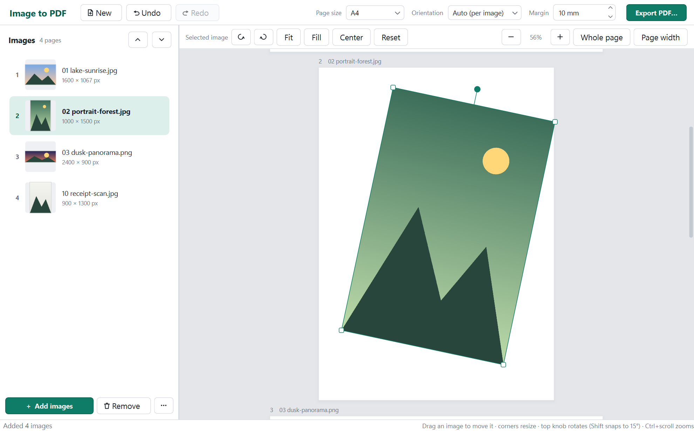

# image-to-pdf

Combine multiple images into a single PDF. A Windows desktop app: drop images on the left,
arrange them, and see the PDF on the right exactly as it will be written.



## Use it

Run `image-to-pdf.exe` (no installation, no Python needed). Then:

- **Add images**: drag files or whole folders onto the window, use **+ Add images**, or
  drop images onto the `.exe` icon. JPG, PNG, WebP, TIFF, BMP and GIF are supported.
- **Order pages**: drag rows in the left list (multi-select with Ctrl/Shift), or use the
  up/down buttons (Ctrl+Up / Ctrl+Down). *More → Sort by file name* sorts naturally
  (`img2` before `img10`).
- **Arrange an image on its page** (right side):
  - drag the image to move it; it snaps to the page centre, Shift locks the axis
  - drag a **corner** to resize; the opposite corner stays put and the aspect ratio is kept
  - drag the **round knob** above the image to rotate; it snaps to right angles, Shift snaps to 15°
  - arrow keys nudge (Shift = 10×)
  - toolbar: rotate 90° left/right (Ctrl+Shift+R / Ctrl+R), **Fit** inside the margins,
    **Fill** the page, **Center**, **Reset**
  - anything outside the page is dimmed: it will be cropped in the PDF
- **Page settings** (top bar): A4, Letter, A3, A5, Legal or *Fit to image* (each page exactly
  the size of its image); orientation *Auto* (per image), Portrait or Landscape; margins in mm.
  Size and position adjustments survive changing these.
- **Undo / redo** everything: Ctrl+Z / Ctrl+Y.
- **Export PDF…** (Ctrl+S). The "Saved" dialog has a **New PDF** button to go straight on.
- **New** (Ctrl+N) clears the images for the next PDF and keeps your page settings.
  Ctrl+Z brings the previous images back.

Zoom the preview with Ctrl+scroll, the −/+ buttons, *Whole page* (Ctrl+0) or *Page width*.

### Quality

JPEG photos are embedded in the PDF **byte-for-byte**, with no re-compression. EXIF rotation
from phones and cameras is applied as a PDF transform, so it is lossless too. Other formats
are stored losslessly, with transparency kept.

### Command line

```bash
image-to-pdf.exe --export out.pdf photo1.jpg photo2.png some-folder
```

Options: `--size {A4,Letter,A3,A5,Legal,"Fit to image"}`, `--orientation {auto,portrait,landscape}`,
`--margin MM`. Each image is fitted on its own page.

## Develop

```bash
python -m venv .venv
.venv\Scripts\python -m pip install -r requirements-dev.txt
.venv\Scripts\python -m image_to_pdf
.venv\Scripts\python -m pytest
```

Build the single-file executable into `dist\image-to-pdf.exe`:

```bash
powershell -ExecutionPolicy Bypass -File build.ps1
```

### Layout

| Path | What |
|---|---|
| `image_to_pdf/model.py` | Document, page geometry, undo. Pure Python, no Qt |
| `image_to_pdf/pdf_export.py` | reportlab writer; uses the same `resolve()` as the preview |
| `image_to_pdf/imaging.py` | Pillow probing/decoding, EXIF handling |
| `image_to_pdf/ui/` | PySide6 window, image list, page preview, theme |
| `tests/` | model, export (rendered back through QtPdf), GUI interaction |

Placements are stored relative to the page (centre as a fraction, width as a multiple of the
"fit" width), so changing paper size or margins keeps your adjustments proportional.

Stack: Python 3.12+, PySide6 (Qt 6), Pillow, reportlab, PyInstaller.
