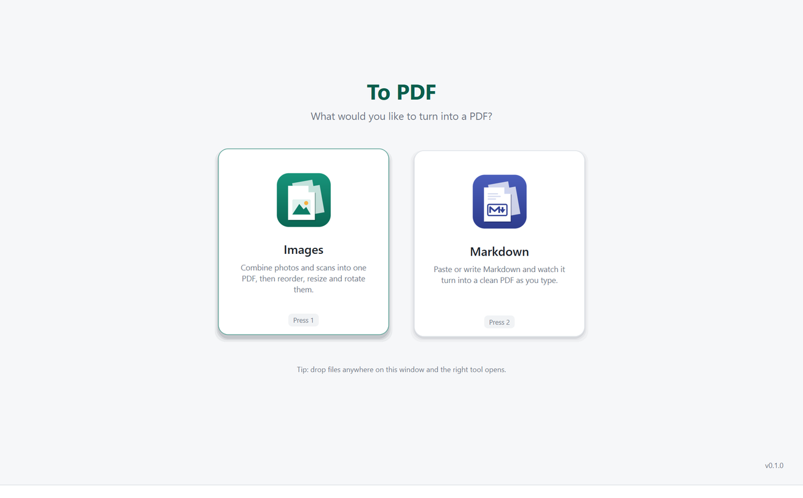
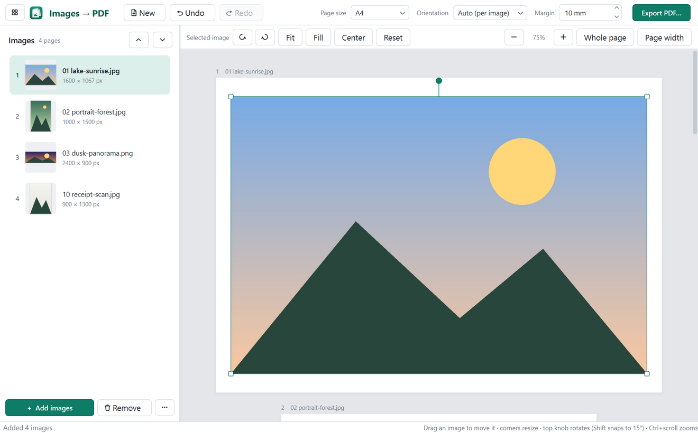
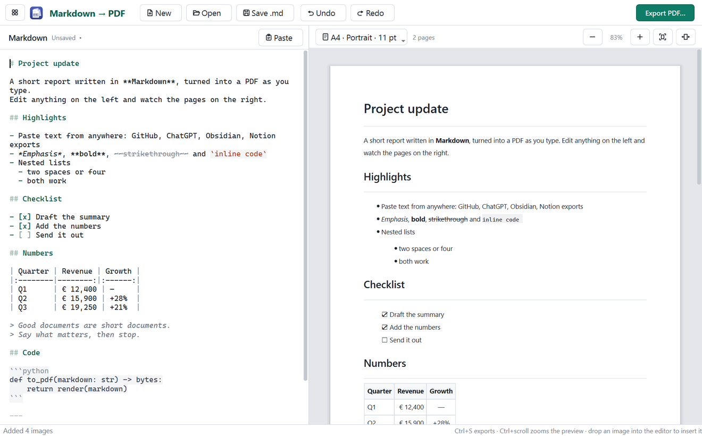

# To PDF

Turn images or Markdown into a clean PDF, with a live preview of every page. A single Windows `.exe`: no installation, no account, and your files never leave your computer.



## Images → PDF

Drop in photos or scans, drag them into order, and adjust each page. Drag to move, pull a corner to resize, and use the knob to rotate. Pick A4, Letter or "fit to image", then export. JPEG photos go into the PDF unchanged, and phone photos come out the right way up.



## Markdown → PDF

Paste Markdown from GitHub, ChatGPT, Obsidian or anywhere else. Edit it on the left, and the paginated PDF updates on the right as you type. Tables, task lists, code blocks and images are supported, and you can set paper size, margins, text size and page numbers.



## Download

Get **To PDF.exe** from [Releases](https://github.com/Picasso2453/to-pdf/releases) and double-click it.

Handy extras:
- Ctrl+N starts the next PDF.
- Ctrl+S exports.
- Drop files anywhere and the right tool opens.
- From the command line: `"To PDF.exe" --export out.pdf notes.md` or `"To PDF.exe" --export out.pdf photos-folder`.

## License

**Free for personal and other non-commercial use** under the [PolyForm Noncommercial License 1.0.0](LICENSE.md).

**Commercial use needs a paid licence.** That includes selling it, bundling it into a paid product or service, or using it in a business. To arrange one, [open an issue](https://github.com/Picasso2453/to-pdf/issues/new?title=Commercial%20licence) titled *Commercial licence*.

Copyright © 2026 Picazzo Research & Development.

<details>
<summary>Build from source</summary>

```bash
python -m venv .venv
.venv\Scripts\python -m pip install -r requirements-dev.txt
.venv\Scripts\python -m to_pdf
.venv\Scripts\python -m pytest
powershell -ExecutionPolicy Bypass -File build.ps1
```

The build step writes `dist\To PDF.exe`. Built with PySide6 (Qt, LGPLv3), Pillow, reportlab, markdown-it-py and PyInstaller, each under its own licence.
</details>
